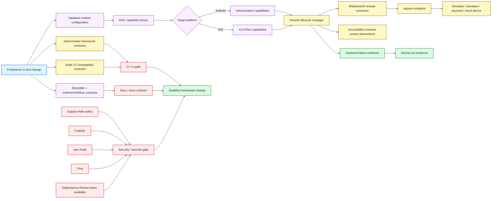

# Mobile Quality Engineering Framework — Appium + WebdriverIO

[](https://github.com/portyu9/qa-automation-mobile-appium/actions/workflows/ci.yml)
[](https://github.com/portyu9/qa-automation-mobile-appium/actions/workflows/security.yml)
[](https://github.com/portyu9/qa-automation-mobile-appium/actions/workflows/docs.yml)
[](https://github.com/portyu9/qa-automation-mobile-appium/actions/workflows/device-smoke.yml)

[](https://appium.io/)
[](https://webdriver.io/)
[](https://www.typescriptlang.org/)
[](https://nodejs.org/)
[](https://developer.android.com/)
[](https://developer.apple.com/documentation/xctest)
[](https://www.w3.org/TR/webdriver2/)
[](https://github.com/features/actions)
[](https://trivy.dev/)
[](LICENSE)
[](SECURITY.md)

A cross-platform mobile quality-engineering framework built around **Appium**, **WebdriverIO**, and strict TypeScript. The repository separates deterministic framework qualification from hardware-dependent execution so CI can prove configuration, W3C capability policy, session lifecycle, evidence semantics, synchronization rules, and supply-chain controls without pretending that a shared Linux runner is an Android or iOS device lab.

> [!IMPORTANT]
> Deterministic framework health and real-device product behavior are different quality signals. A green CI run proves the mobile automation harness is internally coherent; it does not claim that an application works across physical devices, OS versions, OEM variants, signing configurations, networks, or provider infrastructure.

**Read by intent:** [capabilities](#capability-map) · [architecture](#architecture) · [execution model](#execution-model) · [runtime contract](#runtime-contract) · [platform policy](#android-and-ios-capability-policy) · [real devices](#real-device-smoke) · [evidence](#evidence-and-failure-behavior) · [CI/security](#ci-and-security) · [repository map](#repository-map)

## Capability map

| Validation plane | What it proves | Default execution | Primary evidence |
| --- | --- | --- | --- |
| Repository quality | Lint, strict types, docs, workflow-pin policy | repository-pinned Node/npm toolchain | Command conclusions |
| Framework contracts | Configuration, capabilities, lifecycle, waits, redaction, evidence | Node native test runner + injected session doubles | TAP with exact execution floor |
| Android policy | W3C/Appium namespacing and UiAutomator2 capability construction | Deterministic contract tests | Capability assertions |
| iOS policy | W3C/Appium namespacing and XCUITest capability construction | Deterministic contract tests | Capability assertions |
| Session lifecycle | Connect → execute → capture-on-failure → delete-session semantics | Injected WebdriverIO connector | Lifecycle assertions |
| Device smoke | Real hierarchy/queryability and session teardown | Manual Appium/device provider workflow | Device-session evidence |
| Security | Workflow-policy, source, advisory, dependency/configuration/secret and PR dependency-change signals | Supply-chain policy + CodeQL + npm Audit + Trivy + Dependency Review when available | Stable `security-gate` |
| Documentation | README/runtime/workflow consistency | Repository-local validator | Docs workflow status |

## Architecture



The architecture keeps four ownership boundaries explicit: runtime configuration validates external values; the capability layer translates validated intent into platform-specific W3C/Appium capabilities; the session layer owns connection and teardown; screen abstractions express user intent without hiding WebDriver synchronization semantics. See [Architecture](docs/architecture.md).

## Engineering invariants

| Concern | Framework contract |
| --- | --- |
| Configuration | Malformed, ambiguous, or unsafe endpoint/capability input fails before remote session creation. |
| Capability namespacing | Appium extension capabilities use the `appium:` namespace; platform-specific settings remain explicit. |
| Platform drivers | Android uses UiAutomator2 and iOS uses XCUITest; the framework does not silently substitute automation engines. |
| Target identity | Device UDID, platform version, application identifier, provider credentials, and signing data are deployment inputs, never invented defaults. |
| Reset semantics | `noReset` and `fullReset` cannot both be active. |
| Session ownership | The component that opens a remote session is responsible for deterministic deletion. |
| Failure precedence | Evidence/teardown errors do not erase the original test failure. |
| Synchronization | Explicit conditions and WebDriver state express readiness; fixed sleeps are prohibited by repository policy. |
| Selectors | Accessibility identifiers are preferred because they are intentional, cross-platform application contracts. |
| Evidence privacy | Automatic evidence is bounded and sanitizes capability/error metadata; secrets are not valid diagnostic payloads. |
| Deterministic CI | Required CI uses session doubles and temporary evidence directories rather than pretending to provide hardware coverage. |
| Device execution | Hardware-dependent smoke remains explicit and manually supplied with an authorized Appium endpoint/application target. |
| Supply chain | Workflow policy, npm Audit, Trivy, CodeQL, and Dependency Review remain independent controls. |

## Execution model

`npm run quality` is the deterministic qualification gate. It performs repository policy checks, strict TypeScript validation, documentation validation, immutable workflow validation, framework tests, and TAP evidence validation. The governed framework suite uses injected session doubles and temporary evidence directories, so it can prove lifecycle and failure semantics without opening a real device connection.

```bash
npm ci --ignore-scripts --no-audit --no-fund
npm run quality
```

The framework test command builds first, writes TAP evidence, and then verifies that the expected non-trivial execution floor was actually recorded:

```bash
npm run test:framework
npm run test:evidence:check
```

`npm run device:smoke` is intentionally different. It establishes a real Appium session using environment-supplied capabilities, proves that the application hierarchy is queryable, records non-secret session evidence, and always attempts to delete the session.

## Runtime contract

Copy `.env.example` into a local secret-managed environment or supply the same values through your device provider/CI secret mechanism. Do not commit environment files, cloud credentials, signing material, application binaries, or provider access tokens.

| Variable | Purpose |
| --- | --- |
| `APPIUM_SERVER_URL` | Absolute HTTP(S) Appium endpoint; credentials, query strings, and fragments are rejected. |
| `MOBILE_PLATFORM` | `android` or `ios`. |
| `DEVICE_NAME` | Human-readable target device name. |
| `APP_PATH` / `APP_ID` | At least one application target: app reference or platform application identifier. |
| `PLATFORM_VERSION` | Optional explicit OS version. |
| `DEVICE_UDID` | Optional explicit device identifier. |
| `CLOUD_OPTIONS_JSON` | Optional vendor-namespaced capabilities; secret-like keys are rejected. |

Additional Android package/activity values, reset policy, command timeout, and evidence-directory settings are validated at the same environment boundary. Provider credentials belong in the provider's authentication mechanism, not in capability JSON that may be logged or attached.

> [!WARNING]
> A syntactically valid remote URL is not operational authorization. Teams integrating a device cloud should add environment-specific allowlists, secret boundaries, application ownership rules, and data-handling policy around the reusable framework.

## Android and iOS capability policy

Android sessions use **UiAutomator2**; iOS sessions use **XCUITest**. Appium extension capabilities are always namespaced with `appium:`. Shared W3C fields stay shared, while platform-specific values are built only for the selected platform.

The framework deliberately does not guess device identity, platform version, app/package/bundle identity, provider-specific options, or credentials. Those values belong to the environment that owns the hardware. This keeps local emulators, simulators, physical devices, and remote device clouds behind one validated runtime contract without flattening their operational differences.

See [Capability policy](docs/capability-policy.md) for the detailed matrix and [Device execution](docs/device-execution.md) for environment guidance.

## Real-device smoke

The `device-smoke` workflow is manual by design. Shared GitHub-hosted Linux runners do not provide trustworthy iOS hardware, and an automatically provisioned Android emulator would still represent only one narrow environment rather than the device matrix a mobile product may need.

For local execution:

```bash
npm ci --ignore-scripts --no-audit --no-fund
npm run build
npm run appium
# in another shell with the validated runtime variables exported
npm run device:smoke
```

Install and version the Appium platform driver required by the target environment before starting the server. Driver versions, application binaries, signing configuration, device images, and provider capabilities are deployment inputs and should be pinned by the environment that owns the hardware.

A production device strategy should make dimensions such as OS line, device class, locale, permissions, orientation, network state, biometric support, push notification support, deep links, and hybrid contexts explicit rather than multiplying an opaque "end-to-end" suite.

## Evidence and failure behavior

A failed session task attempts to collect three bounded evidence classes:

1. screenshot evidence;
2. page-source evidence;
3. sanitized capability and error metadata.

Evidence collection is best-effort and cannot replace the original test failure. Session deletion occurs in `finally`; a teardown failure is surfaced as primary only when no earlier failure exists. That precedence keeps diagnosis causal instead of allowing cleanup noise to overwrite the defect that triggered cleanup.

> [!CAUTION]
> Screenshots and page source can contain application-visible or personally identifiable data even when metadata is sanitized. Use synthetic test accounts/data where possible and apply retention/access policy to device-lab artifacts.

## CI and security

The qualified deterministic runtime uses the repository-designated primary Node runtime with npm on the governed Linux CI runner. CI also proves the declared Node compatibility contract independently and exposes a stable `CI / ci-gate` conclusion.

- `ci.yml` — repository quality, strict TypeScript, deterministic framework tests, TAP evidence validation, and compatibility qualification.
- `docs.yml` — documentation/runtime/repository-map consistency.
- `security.yml` — immutable Action policy, CodeQL, HIGH/CRITICAL npm Audit, attributed Trivy scanning with development dependencies, conditional PR Dependency Review, and stable `Security / security-gate` aggregation.
- `device-smoke.yml` — explicit manual hardware/provider execution boundary.

When GitHub Dependency graph is unavailable, the workflow records the limitation and keeps npm Audit and Trivy active as repository-wide controls. Those scanners are not represented as equivalent to change-aware Dependency Review.

Dependabot checks npm and GitHub Actions weekly. Application binaries, platform drivers owned by a device environment, provider accounts, and signing credentials intentionally remain outside the repository dependency graph.

## Confidence boundaries

Mobile automation crosses framework policy, Appium protocol/session lifecycle, application state, device operating systems, provider infrastructure, and physical hardware. The repository keeps those confidence claims separate.

| Signal | Confidence gained | Deliberate limit |
| --- | --- | --- |
| Framework/session-manager contracts | Capability construction, runtime validation, session ownership, teardown precedence, sanitization, and evidence policy behave deterministically with controlled doubles | They do not prove that an Appium server, driver, application binary, emulator, simulator, cloud device, or physical device is reachable or compatible |
| Capability policy | Platform, target, reset behavior, cloud-option structure, and secret-like configuration are validated before session creation | Valid capabilities are admissible configuration, not proof that a provider accepts them or that the requested device exists |
| Screen/page abstractions | Application interactions and assertions have stable ownership without hiding the underlying WebdriverIO/Appium session model | A screen abstraction cannot make an unstable locator, inaccessible element, or unsupported platform behavior reliable |
| Failure evidence before teardown | A primary test failure can retain bounded diagnostics while teardown/evidence failures cannot silently replace the original cause | Captured evidence may still be incomplete if the device/provider is unreachable or the session is already irrecoverable |
| Manual real-device smoke | A protected environment can create a real session, retrieve meaningful application hierarchy/context information, and close the session with retained sanitized evidence | One successful device/provider/platform run is not universal device, OS, form-factor, locale, network, permission, performance, or application coverage |
| Serialized device workflow | Concurrent manual runs do not intentionally compete for the repository's shared device-lab execution slot | Serialization does not create provider capacity, eliminate external queueing, or guarantee device availability |
| Success summary artifact | A green device run retains non-secret platform/device/context/capability evidence rather than relying only on logs | The summary proves the executed session boundary, not user-journey correctness beyond the smoke assertions |
| Deterministic CI | Framework behavior remains testable without requiring paid cloud devices or lab availability | Green deterministic CI deliberately cannot substitute for real-device qualification |
| CodeQL / npm Audit / Trivy / dependency review | Independent controls inspect source, advisory, repository/configuration/secret, and dependency-diff surfaces | Green scanners are scoped evidence, not proof of vulnerability absence |

Treat device coverage as a **risk matrix**, not a count of sessions. Add platforms, OS generations, form factors, locales, permission states, networks, and providers only when product risk requires them; do not confuse one broad matrix with deterministic framework health.

## Repository map

Only directories are shown.

```text
.
├── .github/
│   ├── scripts/
│   └── workflows/
├── docs/
├── scripts/
├── src/
│   ├── capabilities/
│   ├── config/
│   ├── screens/
│   ├── session/
│   └── support/
└── tests/
    ├── device/
    └── framework/
```

Root files own runtime/toolchain pins, TypeScript configuration, dependency reproducibility, contribution/security policy, and environment examples; they are intentionally omitted from the directory-only map.

## Failure triage

| Signal | First interpretation |
| --- | --- |
| Runtime validation failure | Environment/capability contract is invalid before network activity. |
| Capability contract failure | Android/iOS namespacing or policy drift. |
| Session connection failure | Appium endpoint, device availability, provider auth, or target configuration. |
| Selector/wait failure | Application-visible state, selector contract, or synchronization condition. |
| Evidence validator failure | The intended deterministic tests were not proven to have executed. |
| Teardown-only failure | Session/provider cleanup defect after otherwise successful work. |
| npm Audit / Trivy / CodeQL failure | Independent dependency, repository, or source security signal. |
| Device-only failure | Hardware/OS/application/environment behavior not reproduced by deterministic harness contracts. |

## Further documentation

- [Architecture](docs/architecture.md)
- [Capability policy](docs/capability-policy.md)
- [Device execution](docs/device-execution.md)
- [Contributing](CONTRIBUTING.md)
- [Security policy](SECURITY.md)

The framework is intentionally strict about **policy ownership and failure attribution** while remaining neutral about any one mobile application or device provider. New abstractions should centralize a durable lifecycle, safety, synchronization, capability, or evidence rule—not simply rename WebdriverIO or Appium APIs.