# Mobile Quality Engineering Framework — Appium + WebdriverIO

[](https://github.com/portyu9/qa-automation-mobile-appium/actions/workflows/ci.yml)
[](https://github.com/portyu9/qa-automation-mobile-appium/actions/workflows/security.yml)
[](https://github.com/portyu9/qa-automation-mobile-appium/actions/workflows/docs.yml)

[](https://appium.io/)
[](https://webdriver.io/)
[](https://www.typescriptlang.org/)
[](https://nodejs.org/)
[](https://developer.android.com/)
[](https://developer.apple.com/documentation/xctest)
[](https://www.w3.org/TR/webdriver2/)
[](https://github.com/features/actions)
[](https://trivy.dev/)
[](LICENSE)
[](SECURITY.md)

A cross-platform mobile quality-engineering framework built around **Appium**, **WebdriverIO**, strict TypeScript, and explicit W3C capability/session ownership. Deterministic CI qualifies configuration, platform policy, lifecycle, synchronization, evidence semantics, and supply-chain controls without pretending a shared Linux runner is an Android or iOS device lab.

> [!IMPORTANT]
> Deterministic framework health and real-device product behavior are different signals. A green CI run proves the harness is internally coherent; it does not claim universal device, OS, OEM, signing, network, application, or provider coverage.

**Start here:** [capabilities](#capability-map) · [architecture](#architecture) · [execution](#execution-model) · [runtime](#runtime-contract) · [platforms](#android-and-ios-capability-policy) · [device smoke](#real-device-smoke) · [evidence](#evidence-and-failure-behavior) · [CI/security](#ci-and-security) · [repository map](#repository-map)

## Capability map

| Validation plane | What it proves | Default execution |
| --- | --- | --- |
| Repository quality | Lint, strict types, docs, workflow/runtime policy | Repository-pinned Node/npm |
| Framework contracts | Config, capabilities, lifecycle, waits, redaction, evidence | Node native tests + injected session doubles |
| Android policy | W3C/Appium namespacing + UiAutomator2 capabilities | Deterministic contract tests |
| iOS policy | W3C/Appium namespacing + XCUITest capabilities | Deterministic contract tests |
| Session lifecycle | Connect → execute → evidence-on-failure → delete | Injected WebdriverIO connector |
| Device smoke | Real hierarchy/queryability + teardown | Manual authorized Appium/device environment |
| Security | Source/advisory/repository/dependency-change controls | CodeQL, npm Audit, Trivy, Dependency Review |

## Architecture

```mermaid
flowchart LR
    CHANGE[Framework or test change] --> CFG[Validated runtime configuration]
    CFG --> CAP[W3C capability factory]
    CAP --> PLATFORM{Target platform}
    PLATFORM -->|Android| UIA[UiAutomator2]
    PLATFORM -->|iOS| XCU[XCUITest]
    UIA --> SESSION[Session lifecycle manager]
    XCU --> SESSION
    SESSION --> WDIO[WebdriverIO remote connector]
    WDIO --> APPIUM[Appium endpoint]
    APPIUM --> DEVICE[Emulator · simulator · physical · cloud]
    SESSION --> SCREEN[Accessibility-oriented screens]
    SESSION --> EVIDENCE[Sanitized failure evidence]

    CHANGE --> CONTRACT[Deterministic framework contracts]
    CONTRACT --> GATE[CI / ci-gate]
    EVIDENCE --> DEVICEOUT[Device-run evidence]
    GATE --> RESULT[Qualified framework change]

    classDef entry fill:#DDF4FF,stroke:#0969DA,color:#24292F,stroke-width:1.5px;
    classDef policy fill:#FBEFFF,stroke:#8250DF,color:#24292F,stroke-width:1.5px;
    classDef runtime fill:#FFF8C5,stroke:#9A6700,color:#24292F,stroke-width:1.5px;
    classDef evidence fill:#DAFBE1,stroke:#1A7F37,color:#24292F,stroke-width:1.5px;
    classDef gate fill:#FFEBE9,stroke:#CF222E,color:#24292F,stroke-width:1.5px;
    class CHANGE entry;
    class CFG,CAP,PLATFORM policy;
    class UIA,XCU,SESSION,WDIO,APPIUM,DEVICE,SCREEN,CONTRACT runtime;
    class EVIDENCE,DEVICEOUT,RESULT evidence;
    class GATE gate;
    linkStyle default stroke:#57606A,stroke-width:1.4px;
```



Runtime configuration validates external values; capability policy translates intent into platform-specific W3C/Appium fields; session management owns connection/evidence/teardown; screen abstractions express user intent without hiding WebDriver synchronization. See [`docs/architecture.md`](docs/architecture.md).

## Execution model

Deterministic qualification:

```bash
npm ci --ignore-scripts --no-audit --no-fund
npm run quality
```

This uses session doubles and temporary evidence directories. Real hardware execution is deliberately separate through `npm run device:smoke` and the manual device workflow.

For command details, evidence floors, runtime compatibility, and triage, see [`docs/operations.md`](docs/operations.md).

## Runtime contract

Remote/device input is explicit. Key values include `APPIUM_SERVER_URL`, `MOBILE_PLATFORM`, `DEVICE_NAME`, `APP_PATH`/`APP_ID`, optional `PLATFORM_VERSION`/`DEVICE_UDID`, and optional vendor-namespaced `CLOUD_OPTIONS_JSON`.

Credentials, query strings, and fragments are rejected from the Appium URL; secret-like cloud-option keys are rejected. Provider credentials, signing material, application binaries, and environment secrets belong outside repository configuration.

A syntactically valid endpoint is not operational authorization. See [`docs/operations.md`](docs/operations.md#runtime-configuration).

## Android and iOS capability policy

Android uses **UiAutomator2** and iOS uses **XCUITest**. Appium extension capabilities always use the `appium:` namespace. The framework does not guess device identity, OS version, app/package/bundle identity, provider options, credentials, or signing data.

See [`docs/capability-policy.md`](docs/capability-policy.md) for the detailed platform matrix.

## Real-device smoke

Real-device smoke is manual by design. Shared hosted Linux runners do not provide trustworthy iOS hardware, and one Android emulator would represent only one narrow environment.

```bash
npm run build
npm run appium
# in another shell with validated runtime variables
npm run device:smoke
```

A product device strategy should choose OS generations, device classes, locales, permissions, orientation, network state, biometrics, push, deep links, and hybrid contexts according to risk. See [`docs/device-execution.md`](docs/device-execution.md).

## Evidence and failure behavior

The session owner attempts bounded screenshot, page-source, and sanitized metadata capture on failure, then always attempts session deletion. Evidence/teardown errors do not erase an earlier causal test failure.

Screenshots and page source can contain application-visible or personal data even when metadata is sanitized. Prefer synthetic data and apply retention/access policy to device-lab artifacts.

## Engineering contracts

- **Fail-fast configuration:** malformed/ambiguous endpoint or capability input fails before remote session creation.
- **Explicit platform engines:** Android = UiAutomator2; iOS = XCUITest; no silent substitution.
- **No invented deployment identity:** device/app/provider/signing values come from the owning environment.
- **Reset consistency:** `noReset` and `fullReset` cannot both be active.
- **Session ownership:** the component opening a remote session owns deterministic deletion.
- **Failure precedence:** evidence and teardown cannot mask the original test failure.
- **Observable synchronization:** explicit conditions/WebDriver state replace fixed sleeps.
- **Accessibility-first selectors:** intentional application identifiers are preferred cross-platform contracts.
- **Evidence privacy:** automatic metadata is bounded/sanitized; secrets are invalid diagnostics.
- **Deterministic CI:** framework health uses doubles rather than fabricating device coverage.

## CI and security

- `ci.yml` — repository quality, strict TypeScript, deterministic framework/TAP evidence, compatibility; stable **`CI / ci-gate`**.
- `docs.yml` — documentation/runtime/repository-map contracts.
- `security.yml` — immutable Action policy, CodeQL, HIGH/CRITICAL npm Audit, Trivy including development dependencies, conditional Dependency Review; stable **`Security / security-gate`**.
- `device-smoke.yml` — explicit manual hardware/provider boundary; intentionally no README status badge.

Repository-wide npm Audit/Trivy remain active when Dependency Review is unavailable, but are not represented as equivalent to change-aware dependency review.

## Confidence boundaries

Deterministic framework contracts prove policy/lifecycle mechanics; real-device smoke proves only the explicitly executed session/environment. Neither should be stretched into universal device coverage.

Treat device coverage as a **risk matrix**, not a session count. See [`docs/operations.md`](docs/operations.md#confidence-boundaries).

## Repository map

```text
.
├── .github/
├── docs/
├── scripts/
├── src/
└── tests/
```

## Documentation

| Guide | Use it for |
| --- | --- |
| [`docs/architecture.md`](docs/architecture.md) | Configuration/capability/session/screen/type/dependency boundaries |
| [`docs/capability-policy.md`](docs/capability-policy.md) | Android/iOS W3C and Appium capability matrix |
| [`docs/device-execution.md`](docs/device-execution.md) | Device-lab/provider execution guidance |
| [`docs/operations.md`](docs/operations.md) | Commands, runtime values, real devices, evidence/privacy, CI/security, dependencies, triage |
| [`CONTRIBUTING.md`](CONTRIBUTING.md) | Change-quality expectations |
| [`SECURITY.md`](SECURITY.md) | Security policy |

The main README intentionally retains only the architecture diagram; deeper mobile execution and lifecycle policy lives in `/docs`.

## Design principle

Keep **framework qualification, protocol/session policy, environment authorization, and real-device product behavior** separately attributable. Add device dimensions when product risk requires them—not to make deterministic CI appear more comprehensive than it is.
