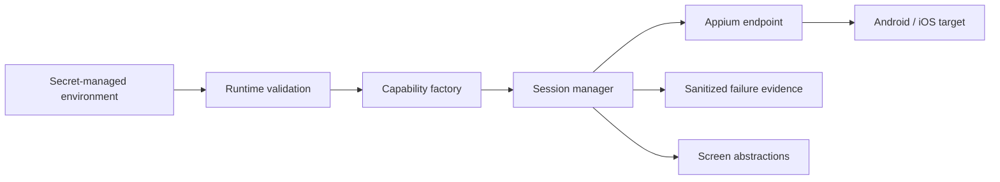

# Architecture

The framework follows four boundaries.

1. **Runtime configuration** parses environment data and rejects malformed or ambiguous values before network activity.
2. **Capability policy** converts validated runtime data into W3C/Appium capabilities while keeping platform differences explicit.
3. **Session lifecycle** owns remote connection, task execution, failure evidence, and teardown.
4. **Screen abstractions** expose user-intent operations using accessibility-oriented selectors and explicit synchronization.

The deterministic test layer injects a session connector rather than opening a device connection. That makes lifecycle and error semantics testable without conflating framework qualification with device qualification.
