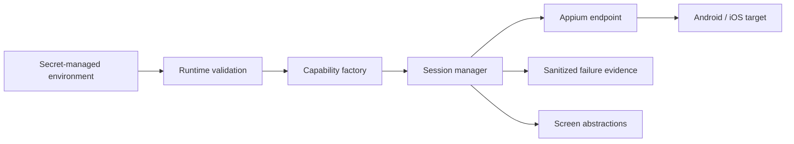

# Architecture

The framework follows four boundaries.

1. **Runtime configuration** parses environment data and rejects malformed or ambiguous values before network activity.
2. **Capability policy** converts validated runtime data into W3C/Appium capabilities while keeping platform differences explicit.
3. **Session lifecycle** owns remote connection, task execution, failure evidence, and teardown.
4. **Screen abstractions** expose user-intent operations using accessibility-oriented selectors and explicit synchronization.

The deterministic test layer injects a session connector rather than opening a device connection. That makes lifecycle and error semantics testable without conflating framework qualification with device qualification.

## Type and dependency boundaries

Application and framework sources are checked with TypeScript strict mode, `noUncheckedIndexedAccess`, `exactOptionalPropertyTypes`, and the other repository compiler contracts. `skipLibCheck` is enabled only for third-party declaration files: WebdriverIO's published declaration graph currently combines Node URLPattern declarations, its URLPattern polyfill, and optional Puppeteer types in ways that conflict under TypeScript. Project `.ts` files remain fully type-checked; the setting does not suppress errors in repository-owned source or tests.

The runtime is Node-only, so the compiler intentionally uses the ES2024 library without browser DOM globals. Mobile UI interaction occurs through the W3C WebDriver/Appium protocol rather than DOM APIs.

WebdriverIO.31.5 currently permits transitive versions that are security-invalid under the repository's HIGH/CRITICAL gate. The root lock policy therefore overrides `deepmerge-ts` to the patched 8.x line and `@puppeteer/browsers` to the 3.x line that removes vulnerable `extract-zip`. Those overrides are accepted only while the full framework suite, Node compatibility job, npm Audit, and Trivy gates remain green; they should be removed when WebdriverIO's own dependency ranges incorporate equivalent fixes.
